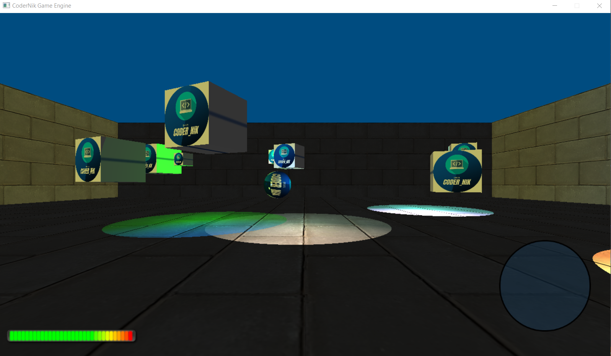
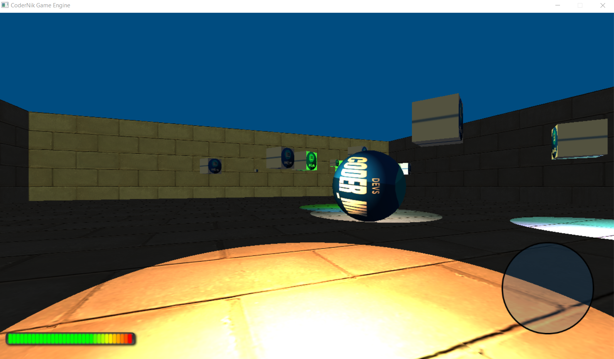
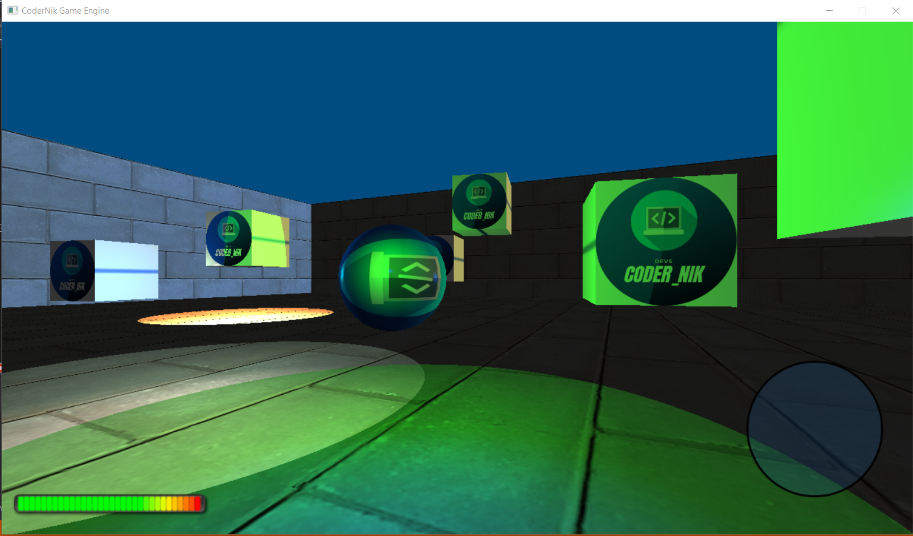

# CoderNik_GameEngine

## A small Game engine written entirely in C++, using OpenGL for graphics and SDL for window, input and audio management.

For now, this game engine is for learning purpose. Soon, I will create a small 3D game in C++.

